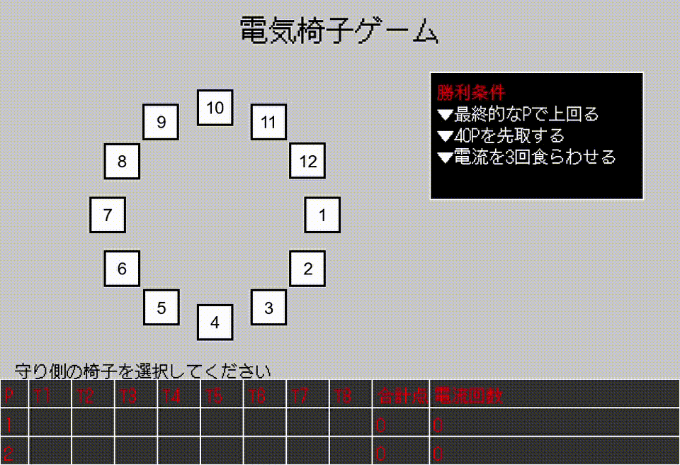

Electric Chair Game

電気椅子ゲームは、2人対戦形式でスリルと駆け引きを楽しめるPython製のゲームです。
攻め側と守り側が交互に椅子を選択し、電流を避けるまたは命中させることで得点や勝利を目指します。

🎮 遊び方

守り側が12個の椅子のうち1つを事前に選びます（この椅子に電流が流れます）

攻め側が椅子を選択し、もし電流付きの椅子を選べば攻め側の得点！

外れれば守り側が得点

プレイヤーは毎ターン交代します

🏆 勝利条件

最終的なP（ポイント）で上回る

40Pを先取する

電流を3回食らわせる

## 🎬 デモプレイ

ゲームのデモプレイは以下のGIFでご覧いただけます：

💻 必要環境

Python 3.9以上推奨

pygameライブラリ

pip install pygame

▶️ 実行方法

python main.py

📁 構成ファイル

main.py：メインのゲームループ

game_logic.py：ゲームの進行ロジック

game_state.py：ゲーム状態の管理

chair_buttons.py：椅子の描画

text_drawer.py：テキスト描画ヘルパー

prompt_defender.py：ターンの案内

scoreboard.py：スコアボード表示

font/：フォント格納ディレクトリ

✍️ クレジット

DotGothic16 フォント：Google Fontsより

pygame：Python製ゲームライブラリ